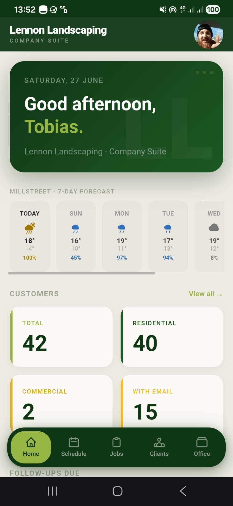
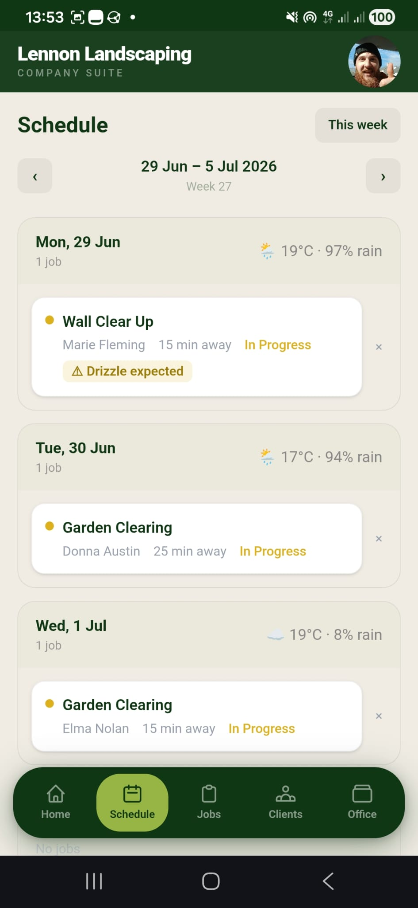
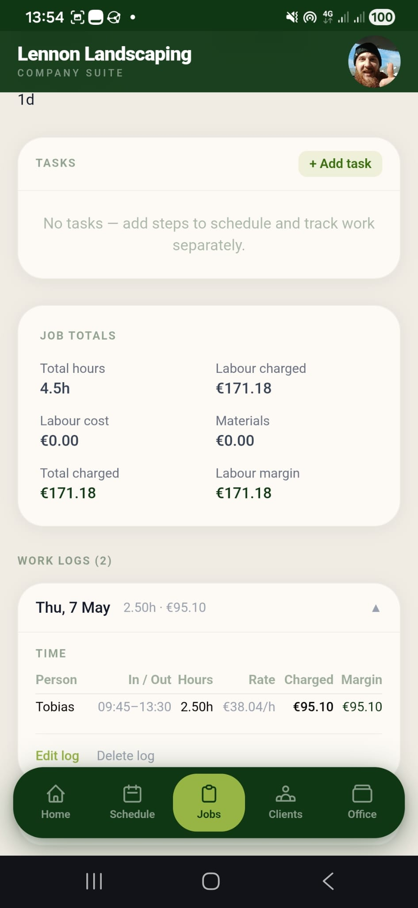

# Lennon Landscaping — Company Suite

A full-stack Progressive Web App built to run the day-to-day operations of a real landscaping business. Handles everything from customer records and job scheduling through to invoicing, payroll, and crew management — replacing spreadsheets and paper with a single mobile-first tool used in the field every day.

**Live deployment:** [suite.lennonlandscaping.ie](https://suite.lennonlandscaping.ie)

---

## Screenshots

<table>
  <tr>
    <td align="center"><b>Dashboard</b></td>
    <td align="center"><b>Schedule</b></td>
    <td align="center"><b>Job Detail</b></td>
  </tr>
  <tr>
    <td></td>
    <td></td>
    <td></td>
  </tr>
</table>

---

## Demo

This is a live production application. Demo access is available on request — get in touch via [tobiaseastwoodlennon@gmail.com](mailto:tobiaseastwoodlennon@gmail.com).

---

## Tech Stack

**Backend**
- PHP 8.3 / Laravel 11 (REST API)
- MySQL
- DomPDF (invoice & payslip PDF generation)
- PHPUnit (feature & unit test suite)

**Frontend**
- React 19 + TypeScript
- Vite + Tailwind CSS v4
- Vitest + React Testing Library
- Axios, React Router v7

**Infrastructure**
- Installable PWA (Web App Manifest + Workbox service worker)
- Deployed to shared Linux hosting via custom Python deployment script
- Versioned builds with automatic update prompts on new deploys

---

## Features

### Customers
- Full CRUD with contact info, address, eircode, notes, and star rating
- Per-customer discount percentage, custom hourly rate, and default callout fee
- **Follow-up system** — log informal interest or verbal requests against a customer with an optional reminder date; unresolved follow-ups surface on the dashboard

### Jobs
- Four job types: **Standard**, **Maintenance**, **Site Visit**, and **Internal** (admin tasks with no customer)
- Status pipeline: Backlog → Scheduled → In Progress → Complete
- Smart default sort: in-progress first, then scheduled by date (overdue at top), then backlog by due date
- **Job Tasks** — sub-items on a job that can each be independently scheduled, assigned, and tracked to completion

### Work Logs
- Each log represents one site visit on a job
- Per-employee hour and rate entries, with billable hours and amount charged tracked separately
- Materials and supplies logged per visit with per-job totals (labour cost, labour margin, materials)

### Schedule
- 7-day calendar view with week navigation
- **Drag-and-drop scheduling** — tap and hold a job or task card to lift it, drag to any day slot to assign (touch-native, works on mobile)
- **Weather-aware scheduling** — each job carries a weather requirement (`dry only`, `frost free`, etc.); the calendar shows weather icons and flags conflicts per day
- **Per-customer weather forecasts** — jobs show the forecast at the customer's location, not just the office
- **Scheduling suggestions** — a "best day" chip on unscheduled cards calculates the earliest suitable day based on weather and due date

### Weather
- Powered by Open-Meteo (no API key required)
- 9 weather conditions supported
- Forecasts cached per location to avoid redundant API calls

### Invoices
- Sequential invoice numbering (`LL-YYYY-NNN`)
- Line items broken down by labour (grouped per visit), materials, and callout fees
- Customer discount applied at subtotal level before VAT
- 13.5% VAT calculated at invoice time
- PDF invoice and receipt generation
- Payment methods: bank transfer or cash (with optional round-up to nearest €10)
- **Maintenance Loyalty Programme** — customers accumulate points across maintenance visits; the invoice PDF shows their running balance and redeems a complimentary visit when the threshold is reached

### Payroll
- Employee records with PPSN, tax credits, and payroll-relevant details
- Payroll runs covering a defined date range
- Per-employee payslip calculation with PAYE, PRSI, and USC breakdowns
- Payslip PDF generation and email delivery
- Employee self-service: crew members can view their own hours and payslips

### Leads
- Sales pipeline for prospective customers
- Statuses: New → Contacted → Site Visited → Quoted → Converted / Lost
- One-click conversion from lead to customer record

### Contacts
- Address book for suppliers and business contacts, separate from customers

### Dashboard
- Live 7-day weather forecast for the business location
- Follow-ups due within 7 days with colour-coded urgency
- Customer stats snapshot
- Quick-action tiles for common tasks

### Access Control
- Three roles: **Admin**, **Field** (crew), and **Customer**
- Route and API protection per role
- Avatar upload per user

---

## Architecture Notes

The app follows a clean API + SPA separation:

- Laravel handles all data, business logic, PDF generation, and authentication (Sanctum token-based)
- React consumes the API; all navigation is client-side with React Router
- The PWA service worker caches the shell so the app loads instantly after the first visit and works offline for cached routes
- Builds are versioned via `version.json`; the frontend polls on focus and prompts the user to update when a new version is deployed

### Rate & Billing Logic
- A rate card defines base rate, tool surcharge, waste surcharge, and maintenance rate
- `RateCalculationService` resolves the correct rate per work log entry, respecting per-customer overrides
- Customer discounts are applied by `InvoiceGenerationService` at the subtotal level only, not baked into hourly rates

---

## Tests

```bash
# Backend (PHPUnit)
cd backend
php artisan test

# Frontend (Vitest)
cd frontend
npm run test
```

The backend suite covers all major API endpoints — customers, jobs, work logs, invoices, payroll, scheduling, leads, contacts, rate cards, and settings — plus unit tests for payroll calculations. The frontend suite covers form validation and UI behaviour across all major pages.

---

## Project Context

This is a live production application built for and used by Lennon Landscaping, a landscaping and garden maintenance business based in Millstreet, Co. Cork, Ireland. It was designed and built as an internal operations tool to replace manual processes — not as a generic SaaS product.

The codebase reflects that context: business rules (rate cards, VAT rates, loyalty thresholds) are specific to the company's needs rather than configurable abstractions.
